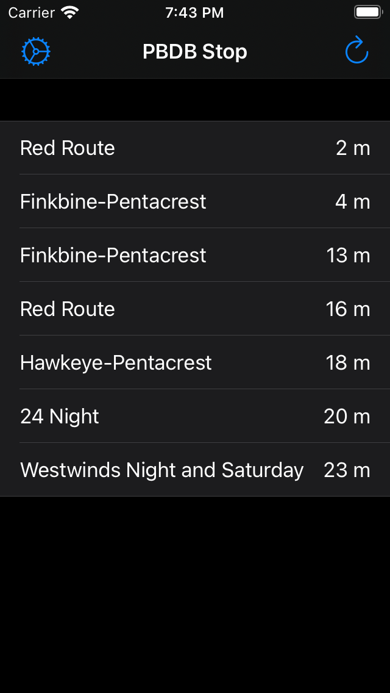

# PBDBStop

## What is PBDB?

It is an acronym for the building near my office at the time.

## Why this app?

When I worked at the University of Iowa there was a bus stop just outside my office. I would often use that bus stop to catch a bus to go home or downtown after work. The University supplied a mobile app called eBongo that allowed bus riders to see upcoming buses for any given stop. The app allowed setting favorites and searching for routes or stops. Basically, it did a lot of things that I didn't need. So, I created this app to simply list the upcoming arrivals for the one stop I used.

I spun of [BongKit](https://apps.apple.com/app/apple-store/id498151501), a separate API to make working with the Bongo API easy.

This was the first time I use the Settings app to store settings for an app.

I also used a struct with different states to make rendering the table view a breeze.

## Screen Shot

